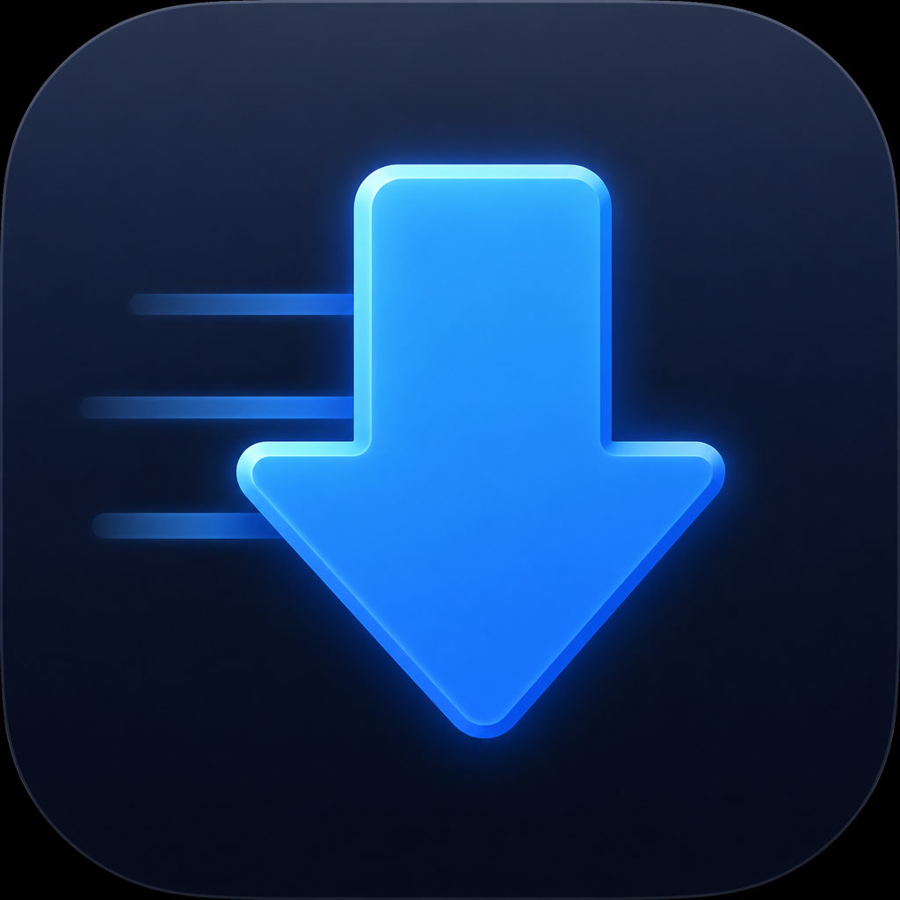
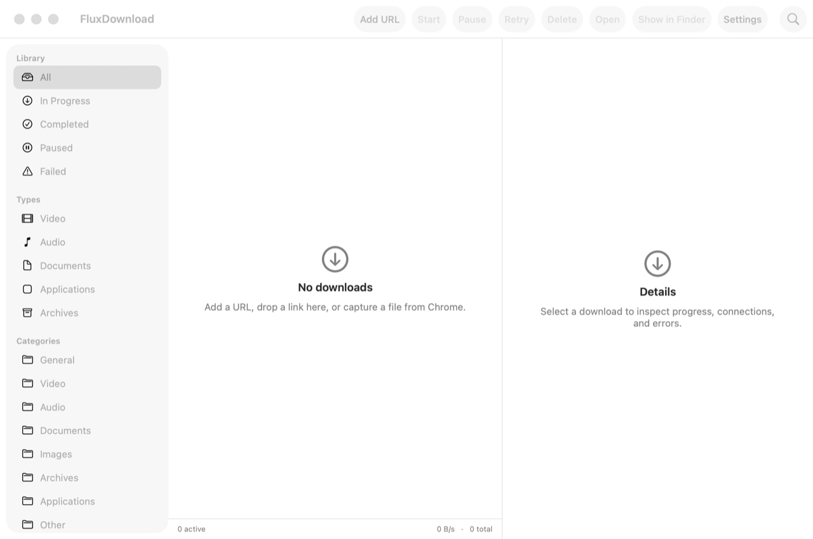

<p align="center">
  
</p>

<h1 align="center">FluxDownload</h1>

<p align="center">
  Native macOS download manager for HTTP, HTTPS, and captured video.<br>
  Queues, pause/resume, Chrome capture, HLS — no cloud, no analytics.
</p>

<p align="center">
  <a href="LICENSE"></a>
  <a href="Package.swift"></a>
  <a href="Package.swift"></a>
  <a href="https://ko-fi.com/moomenaldahdouh"></a>
</p>

## Overview

FluxDownload is a local download manager for macOS. It runs as a menu-bar app, keeps transfers going after you close the window, and can take files (and many video streams) from Chrome through native messaging.

It is original software — not a rebrand of Internet Download Manager.

<p align="center">
  
</p>

## Requirements

- macOS 14 or later
- Swift 6 (Apple Command Line Tools are enough; Xcode is not required)
- Optional: Google Chrome for browser capture

Safari support needs Xcode and is not in this tree yet.

## Install and run

```bash
git clone https://github.com/MoomenALdahdouh/FluxDownload.git
cd FluxDownload

# Build the .app (also registers the Chrome native host)
bash Scripts/package-app.sh

open build/FluxDownload.app
```

The first launch is ad-hoc signed. If Gatekeeper blocks it, open **System Settings → Privacy & Security** and allow FluxDownload, or right-click the app and choose **Open**.

Quit from **FluxDownload → Quit** (or the menu bar). Closing the window does not stop downloads.

### Chrome capture (optional)

1. Open FluxDownload once so the native host is registered.
2. Chrome → `chrome://extensions` → Developer mode → **Load unpacked** → `Extensions/Chrome`.
3. Play a video (or start a download), then use the overlay or the extension popup to send it to FluxDownload.

The unpacked extension ID must stay `cdhmompibjahkccghpbepifodgcallpi` (it is pinned in `manifest.json`).

### CLI (optional)

```bash
swift run fluxdownload-cli --help
```

## What it does

- HTTP(S) downloads with Range acceleration and a single-stream fallback
- Pause / resume metadata, queues, and a scheduler (while the app is running)
- Chrome native messaging: capture downloads and media URLs, including many HLS streams
- YouTube progressive MP4 (itag 18) and higher video-only qualities with companion audio when needed
- LinkedIn / `licdn` HLS assembled as `.mp4` from signed segments
- Site grabber with robots.txt limits
- Local SQLite history, no analytics

Protected / DRM streams (Netflix-style) are detected and refused. See `docs/adr/009-no-drm.md`.

## Develop

```bash
swift --version
swift run FluxDownloadTestRunner
swift test                         # if XCTest targets are present
bash Scripts/package-app.sh
```

Package layout and engine notes: [ARCHITECTURE.md](ARCHITECTURE.md), [CONTRIBUTING.md](CONTRIBUTING.md).

## Docs

| File | Topic |
|------|--------|
| [PRIVACY.md](PRIVACY.md) | What stays on disk |
| [BROWSER_INTEGRATION.md](BROWSER_INTEGRATION.md) | Native messaging |
| [VIDEO_DETECTION.md](VIDEO_DETECTION.md) | How media URLs are found |
| [DOWNLOAD_ENGINE.md](DOWNLOAD_ENGINE.md) | Range / HLS engine |
| [TROUBLESHOOTING.md](TROUBLESHOOTING.md) | Common failures |
| [RELEASE.md](RELEASE.md) | Signing and notarization |
| [CHANGELOG.md](CHANGELOG.md) | Version history |

## Support

FluxDownload is free and open source (MIT). If it saves you time:

**[Buy me a coffee](https://ko-fi.com/moomenaldahdouh)** on Ko-fi.

The same link is in **FluxDownload → About**, **Settings** (footer), and **Help → Buy me a coffee**.
